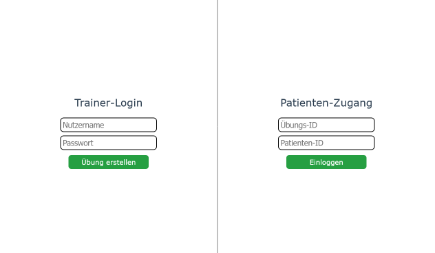
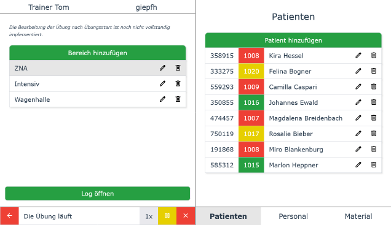
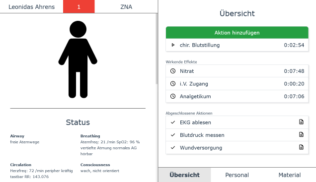

#  Klinik-dPS
The K-dPS (the clinic variant of the dynamic patient simulation) simulation software for training medical personnel on how to act during medical 
surges / during mass casualty incidents. 

It is currently only available in German at https://klinik-dps.de/.

The software is developed as part of a project at the Hasso Plattner Institute in Potsdam, Germany: 
[Project Website](https://hpi.de/giese/teaching/bachelor-projects/digitale-simulationsuebungen-fuer-krankenhaeuser.html).

## Features
The K-dPS offers the following features:
- **Create Exercises**: Trainers can quickly create exercises by adding areas, patients, personnel and material to them and customize names.
- **Dynamic Patients**: Patients dynamically change their state based on the current state as well as the material assigned and actions applied to them.
- **Real-time Interaction**: Trainees can interact with the patients in real-time by applying treatments, conducting examinations and more.
- **Resource Management**: Trainees can assign personnel and material to different patients and manage the resources effectively.
- **Triaging**: Trainees can triage patients based on their state and assign them different triage categories and move them to different areas.
- and much more...

## Introduction
Upon entering the website, you will be greeted with a login screen. You can either log in as a trainer or as a patient. Entering a new username 
and a password, one creates a new exercise and is automatically logged in as a trainer. 

Upon login the Trainer can freely configure the exercise by creating areas and adding patients, personnel and material to them.
If ready, the trainer can start the exercise, activating the dynamic behavior of the patients. To treat the patients, the trainer can log 
into a patient on a separate device by using the exercise-id displayed to the right of their name and the patient-id displayed on the left of 
the patient list items. These logged-in devices can then be given to the trainees.

In the patient view the trainees can assign personnel and material to the patient and interact with the patient by applying treatments, conducting 
examinations and more. The state of the patient displayed on the left is dynamically updated based on the actions of the trainees.

## Technical Documentation
The following list describes where to find the documentation for the different parts of the project:
- Frontend documentation with setup instructions: [frontend folder](./frontend/README.md).
- Backend documentation with setup instructions: [backend folder](./backend/README.md).
- Interface definition (Frontend <-> Backend): [docs file](./docs/interface-definition.md).
- Deployment process: [docs file](./docs/deployment-process.md).
- Tips regarding the project configuration: [docs file](./docs/configuration-tips.md).
- MoSCoW and future plans: [docs file](./docs/moscow.md).

## Thank you
First and foremost, we would like to thank the [Hasso Plattner Institute](https://hpi.de/) for giving us the opportunity to work on this project as well as our 
supervisors Christian Schäffer and Matthias Barkowsky for their guidance and organization of the project.

Right after that come our official project partners, the [ZaNowi](https://zanowi.de/) ("Zentrum für angewandte Notfallwissenschaft") and the 
[Johanniter](https://www.johanniter.de/bildungseinrichtungen/johanniter-akademie/johanniter-akademie-nordrhein-westfalen/standorte-der-akademie-in-nordrhein-westfalen/campus-muenster/) 
("Johanniter Akademie NRW, Campus Münster"), for making the project possible by providing the necessary data and insights.

And last but not least, we would like to thank our supporters: 
- [BABZ](https://www.bbk.bund.de/DE/Themen/Akademie-BABZ/akademie-babz_node.html) ("Bundesakademie für Bevölkerungsschutz und Zivile Verteidigung")
  of the [BBK](https://www.bbk.bund.de/DE/Home/home_node.html) ("Bundesamtes für Bevölkerungsschutz und Katastrophenhilfe")
- [Evangelisches Krankenhaus Hubertus](https://www.johannesstift-diakonie.de/medizinische-versorgung/evangelisches-krankenhaus-hubertus) 
  Berlin-Zehlendorf
- [Universitätsklinikum Düsseldorf](https://www.uniklinik-duesseldorf.de/)

Special thanks to the following people for being directly available to us and providing us with valuable insights and feedback: Frank Sensen 
(ZaNowi), Philipp Rocker (Johanniter) and Daniel Schmitz (Evangelisches Krankenhaus Hubertus).

